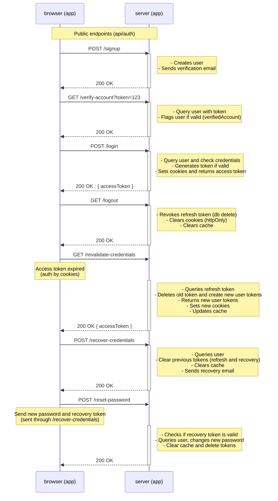

# NestJS Auth bootstrap template

Template for fast NestJS application bootstrapping if you want to role your own auth.

<!-- ([Check it in action here]())  upload video-->

## Why?

This was developed during a larger project and it seemed to be a monster of its own that could be useful for anybody struggling with authentication and authorization in NestJS.

You can roll your own auth and develop everything from scratch (which I certainly encourage you to do), with all the time and pain that involves (totally worth it, yet maybe not for someone in a hurry to ship with urgency).

You can delegate it to battle-tested solutions with third-party packages (OAuth for example). You trust them they do all the heavy lifting for you and taking advantage of the free plans while they last

Or you can try this template if you like to tinker with stuff without paying a dime and always having the control over your auth flow.

## What's included

- Basic `User` and `Role` entities (**TypeORM** implementation)
- **JWT** based authentication:
  - `accessToken` in response body for client manipulation.
  - `Authorization` cookie with refresh token (`HttpOnly`, `SameSite`, `Secure`, `Signed`).
- Signed Double CSRF Cookie pattern implementation:
  - `x-csrf-token` header and `__Host-csrf` cookie token
- Cache store for token rotation on each token revalidation: when `accessToken` expires (**Redis** implementation)
- Docker compose files to work with your development and test environments
- Unit and integration testing (Vitest + [Testcontainers](https://testcontainers.com/)). (Optional docker compose tests too if you don't want to use Testcontainers)
- Basic mail service (**`nodemailer`** solution. You can configure it or change it completely for a different provider)
- Swagger docs (`api/swagger`)
- Basic **`Throttler`** module (mainly useful for production environment. Configure it for your use case)
- Basic **`ClsModule`** module (for [request identification](https://papooch.github.io/nestjs-cls/features-and-use-cases/request-id), should you want to monitor specific requests or share context easily)
- `LoggerModule` with [nestjs-pino](https://github.com/iamolegga/nestjs-pino). (Optional: change log level at runtime)
- [Postman collection](https://www.postman.com/orbital-module-astronomer-66959558/nestjs-auth-bootstrap/collection/16327695-aa18b690-8419-4a22-a824-81af4fae7c19) for faster development and manual testing (environment and pre/post scripts configured)
- **Seed service** for fast development setup
- Tons of comments that explain how things work if you get lost.

## Who is this for

1. _You are developing a backend application with NestJS for any kind of project. You finally need to manage authorization and authentication and don't have a clue how to do so._

2. _You just want something to work out of the box and don't mind adjusting some configs ([explained below](https://github.com/mmiglioranza22/nestjs-auth-bootstrap/tree/main?tab=readme-ov-file#requirements)). You also want the freedom to expand and discard what you don't need for your particular project._

3. _You want a solution you can test fast and ship faster without third-party solutions (You have the control over everything: token cache store, user roles, credentials recovery, account verification, etc)._

## What can you do with this

Whatever you want.

You can use it as is, change the authentication strategy to your use case (OAuth), extend it and implement your own token reuse detection solution, remove any module you do not use and modify what you need, check how tests are setup and configured for NestJS (not a particularly trivial endeavour), add observability and monitoring to see how it scales, convert it into your own auth micro service, try to crack it and find vulnerabilities unknown until now.

License is MIT

## Development

### Requirements

- Docker (4.57.0)
- Node (24.13.0)
- Volta (optional)

After cloning the repository, you should create an `.env.development` file with your own variables using the template provided in the `/config` directory (env file must be located in that directory unless you modify how you want docker compose to look for it)

```
pnpm i
docker compose -f docker-compose.dev.yaml up -d
pnpm run start:dev
```

or my favourite

```
docker compose -f docker-compose.dev.yaml down && docker compose -f docker-compose.dev.yaml up -d && pnpm run start:dev
```

Development server listens to `localhost:3000/api`

Open [Postman collection](https://www.postman.com/orbital-module-astronomer-66959558/nestjs-auth-bootstrap/collection/16327695-aa18b690-8419-4a22-a824-81af4fae7c19) and you are all set.

### Mail service configuration

If you wish to use the implemented **nodemailer** solution, you must create your own account and configure environment variables `MAILTRAP_HOST, MAILTRAP_PORT, MAILTRAP_USER, MAILTRAP_PASSWORD`.
Refer to [mailtrap.io](https://mailtrap.io/) docs to set up your own configuration (sandbox tab)

#### Troubleshooting - Notice on first time running postgres containers

Postgres demands `POSTGRES_PASSWORD` variable to be set on the first time docker compose runs. Although this is done by TypeORM when initializing the application, the password variable at the time the container starts up is not available (It then reads the variable from the `.env.development` file).

Docker needs to read these variables from an `.env` file on startup.

`.env` file is added in this repository for easy testing and development. **If you eventually use your own variables, REMEMBER TO ADD `.env` TO YOUR `.gitignore` FILE.**

This is merely a development issue. For a production release, use the strategy that best suits your CI/CD to prevent using an `.env` file with secrets

## Testing

Requests logs are enabled by default for integration tests. Error logs are disabled by default (you can enable it by changing this condition [here](https://github.com/mmiglioranza22/nestjs-auth-bootstrap/blob/9c70227a4950a985caeff8b610362eefb50da107/src/common/filters/global-exception.filter.ts#L54))

Use `DEBUG=testcontainers*` if you want to check logs when using test containers

If you dont want to use Testcontainers for integration testing, you only need to remove all "Sanity check" tests and logic related to `TestContainersSetup` helper class, and then run:

```
docker compose -f docker-compose.test.yaml down && docker compose -f docker-compose.test.yaml up -d && npx vitest run int
```

## Auth cycle

JWT access token is used for stateless authentication. JWT refresh token used for token revalidation.
Refresh token is stored in cache for token rotation and invalidation. Its key is a random uuid that contains the users information: id, roles and active status.
CSRF token is used as an extra layer of security, in a signed double submission pattern (regular cookie + http header)

`/login` and `/auth/revalidate-credentials` rotates cached tokens.

Accessing `private` routes relies only on valid access token (Authentication check)
Accessing `protected` routes adds csrf token validation plus user's status and role (Authorization check)

`/auth/logout`, user invalidation / modification that denies access, same as valid requests for password change invalidate refresh tokens, forbidding access to protected routes, yet keeping access to private routes for the lifetime of access token (short lived).

Csrf token are rotated on login, revalidate-credentials (alongside access/refresh tokens) and logout. They are otherwise valid per user session until access token expires (which forces all token rotation).



## A note on user roles

[x] There can only exist one user related role (sysadmin, admin, user, guest).

[x] Sysadmin can assign any role, to themselves or other users.

[x] Admins can only assign admin roles and less priviledge roles, to themselves or other users.

[x] Users with plain user and guest roles can't modify any of their own roles, nor modify other users roles

[x] Personal data (like email and password) can only be modified by the users that are affected (Sysadmin can't modify these, yet it can revoke all access/delete any user).

# Special thanks

I will be adding a list of all the resources I used here. This project was made possible in great part thanks to these resources:

- [NestJS official docs](https://docs.nestjs.com/)
- [DevTalles Curso NestJS](https://cursos.devtalles.com/courses/nest)
- [DevTalles Curso NesJS + Testing](https://cursos.devtalles.com/courses/NestJS-Testing)
- [Computerix NestJS playlist](https://www.youtube.com/watch?v=bP7CFznd8o0&list=PLHVUNsO6sqSpeFjQBl1KZMYEI-IL5idqZ)
- [WittCode Security playlist](https://www.youtube.com/watch?v=PbzvureDBJw&list=PLkqiWyX-_Losd0Qc584EcU2A1aHvF7Snc), in particular videos related to JWT access and refresh tokens, CSRF.
- [WebDevSimplified video on CSRF tokens](https://youtu.be/80S8h5hEwTY?si=18kkrUlcDakpKm_f)
